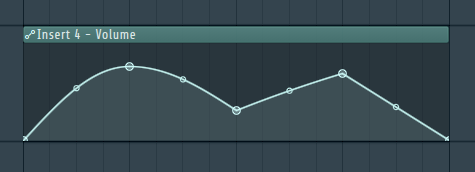

# Hypercube Animation

This is an attempt at making a hypercube animation through parametric interpolation.

Here is the animation (it might take some time to load, sorry ):

## How to play it?

Just open pewpew live (it's on itch.io or steam or play store for free) and go to the experimental tab.

## How?!?!(??)

For this project I had in mind the automation clips of fl studio:

The automation clip can basically be described as a map of parameters, with the key being in a variable range (e.g. 0-16) and the value ranging from 0 to 1. With this you can create a function f(x) that takes in x∈[0, 16] and it would produce a value y∈[0,1]. For instance, f(16) = 0. If f(12) = 0.8, and the interpolation between parameter 12 and 16 was linear, f(14) = 0.4, because it's directly in the middle of the two parameters.

The fact that automation clips are parametric is insanely powerful, since it basically allows you to automate any sort of flow of value, which is very useful in music production as well as other areas.

So the idea was that I would recreate this concept to automate the position and size of 4 squares, which would later be connected with lines between them. The idea of the 4 squares came about from the fact that a hypercube can be thought of a just that: 4 squares sequentially connected with lines between them. By extension, if you just animate those 4 squares, the connected lines would also get animated.